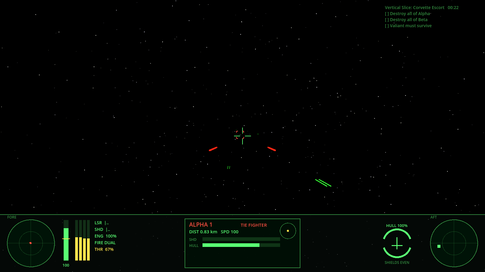

# X-Wing (1993) Runtime Reimplementation

A personal experiment: rebuild the 1993 LucasArts *X-Wing* as close to 1:1 as possible.
Keep its simulation intact and modernize only what sits around it: rendering, input,
resolution, framerate and convenience features.

The goal isn't a game that feels kind of like X-Wing. It's a written, testable
**X-Wing 1993 runtime specification** ([docs/SPEC.md](docs/SPEC.md)) and an engine that meets
it. Every gameplay number in the engine is tagged with where it came from. A harness compares
the engine against values measured in the original running under DOSBox.



## Status: vertical slice

| Area | State |
|---|---|
| Flight model: throttle, accel/decel, speed-dependent turn rate, no drift | ✅ implemented, values **unmeasured** |
| Energy: laser and shield recharge levels, engine trade-off, shield focus, energy transfer | ✅ implemented, values **unmeasured** |
| Lasers (single/dual/quad link), capital ship turrets, shields/hull damage, collisions | ✅ |
| Targeting computer, front and rear sensor scopes | ✅ |
| Fighter AI (5 ranks), capital ship waypoints | ✅ first pass |
| Missions: flight groups, arrival triggers, goals, radio messages, hyperspace | ✅ engine-native JSON |
| Headless runner, determinism, measurement and compare harness | ✅ |
| Godot 4 client: cockpit HUD, procedural placeholder ships, joystick and keyboard | ✅ |
| Warheads (proton torpedoes), tractor beams, ion cannons | ⏳ next |
| Original data import (XWI missions, ship models, sounds) | ⏳ see [ROADMAP](docs/ROADMAP.md) |

## Quick start

Requires the .NET 8 SDK. The client also needs Godot 4.3 **.NET edition**.

```bash
dotnet test                                    # 36 tests: physics, energy, damage, AI, missions, determinism

# Fly the vertical slice headless (the AI flies the player)
dotnet run --project tools/XWing.Headless -- run --seed 3

# Emit every number the engine claims about the original game
dotnet run --project tools/XWing.Headless -- measure --out sim.csv

# Diff against measurements taken from the real game (research/measurements/original.csv)
dotnet run --project tools/XWing.Headless -- compare
```

Playing it: open `godot/project.godot` in Godot 4.3 .NET, build, and press F5.
To watch the AI fly the mission instead:

```bash
godot --path godot -- --autopilot
```

Controls are listed in [docs/CONTROLS.md](docs/CONTROLS.md).

## Layout

```
src/XWing.Sim/          The simulation. No engine dependency; fixed tick; deterministic.
  Core/                 World, Ship, events, math, RNG
  Flight/               Flight model
  Combat/               Energy, weapons, projectiles, damage
  Sensors/              Targeting computer, radar
  AI/                   Pilot AI, skill levels, orders
  Missions/             Mission definition and runtime (triggers, goals, messages)
  Research/             Test-bench experiments + comparison against original-game measurements
  Data/                 Provisional ship catalog and the vertical-slice mission (JSON)
tools/XWing.Headless/   CLI: run / measure / compare / ships
tests/XWing.Sim.Tests/  xUnit tests
godot/                  Godot 4 client: rendering, HUD, input. Presentation only.
research/               Measurement protocol, reverse-engineering notes
docs/                   Architecture, the spec, controls, roadmap
```

## Principles

1. **Simulation ≠ renderer.** `XWing.Sim` knows nothing about Godot. The same `World` runs in
   the client, the headless runner and the tests. See [docs/ARCHITECTURE.md](docs/ARCHITECTURE.md).
2. **Every number has a provenance.** Each one is a placeholder, community-reported, measured
   (DOSBox) or disassembled value, tracked in [docs/SPEC.md](docs/SPEC.md). Right now *all* of
   them are placeholders. That's honest, and it's the first thing to fix.
3. **Measure, don't eyeball.** `measure` and `compare` turn "does it feel right?" into "is it
   within tolerance of the original?".
4. **Deterministic.** Same seed and same inputs give a bit-identical world. That enables replays,
   regression tests and AI tuning by batch simulation.
5. **No drift, no Newton.** X-Wing descends from *Secret Weapons of the Luftwaffe*; its ships
   fly like aircraft in invisible air. That stays.

## Legal

This repository has engine code and original content only: no LucasArts/Lucasfilm assets,
data files or code. Future importers will read data from the user's own legally obtained
installation at runtime, the same approach XWVM takes. `.gitignore` blocks the original's file
types so they can't be committed by accident. Star Wars and X-Wing are trademarks of Lucasfilm
Ltd. This is a non-commercial personal research project.
